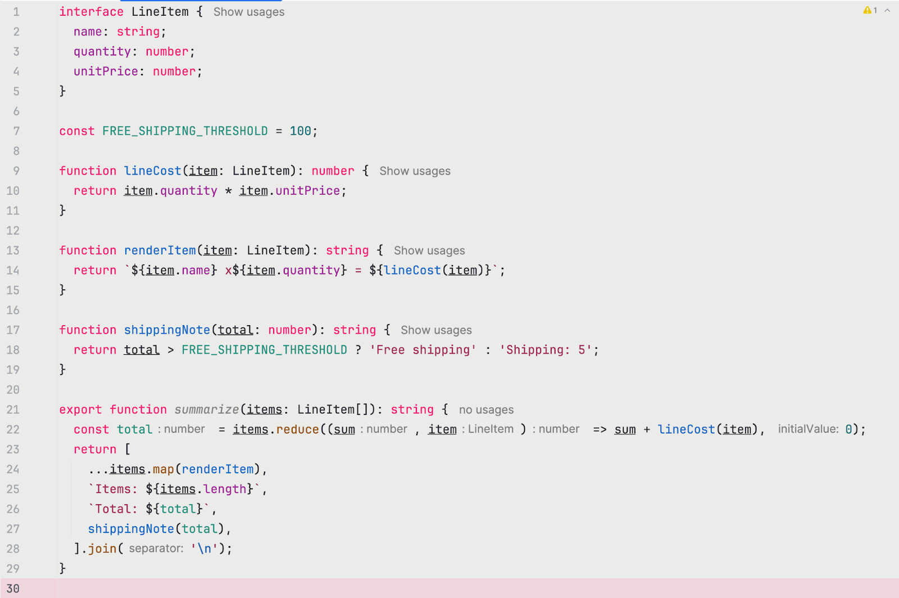

# habit-hooks

Stop reciting software engineering literature to your AI agent.

Turn best practice advice into AI habits, and make it write code like this:



## What it is

AI coding agents frequently ignore long rule documents. Asking them to hold on to an entire book's worth of
coding advice is at best futile, at worst makes the agent's performance worse by polluting the context window.

Humans don't need to hold the same information in their head because humans can form habits through repetition.
However, AI agents can't do this.

Human habits form when an easy-to-detect cue triggers a complex sequence of actions with the desired effect.
This is the inspiration for habit hooks.

Linters provide a deterministic metric, but Goodhart's law postulates that a metric ceases to be a good metric if
it becomes a target. AI agents are very good at gaming these metrics when they are only provided the metric.

Habit hooks wraps your linter to create the trigger, but instead of providing only the metric, it gives actionable
advice on how to fix the issue. This creates AI behaviour that looks like human habits, and has similar effects.

The use of habit hooks:
- Increases code quality
- Improves AI performance ensuring that the AI always starts with good code quality
- Reduces token usage, since good quality code also means the AI doesn't need to read as much context to complete the task.

## Install

```sh
npm install --save-dev habit-hooks
```

habit-hooks depends on `eslint`, `knip`, and `jscpd`, so installing it pulls those in as well — a fresh project gets every wrap target for free. If your project already has its own versions installed, habit-hooks detects and uses those instead and falls back to the bundled binaries only when none is present.

## Quick start

```sh
npx habit-hooks init
```

`init` detects which of eslint / knip / jscpd are already installed and configured, scaffolds starter configs for the missing ones, writes `habit-hooks.config.js` and an empty baseline, and offers to wire up `package.json` scripts, a pre-commit hook, and the bundled reviewer skill. Run with `--dry-run` to see every intended write without touching disk.

Then:

```sh
npx habit-hooks
```

That runs every wrapped tool against files changed since the branch base.

## What it catches

Habit-hooks wraps your existing eslint, knip, and jscpd. Whatever rules and thresholds those tools fire is what habit-hooks surfaces — the rules come from your project's `eslint.config.*`, `knip.json`, `.jscpd.json` (or matching `package.json` keys), not from habit-hooks.

What habit-hooks adds on top is the *why this is a smell* and *how to fix it* guidance. For the rule ids below we ship a coaching prompt; everything else surfaces under a single "Uncoached rules" section so you don't lose visibility on rules we haven't tuned.

**Coached rule ids**

| Source | Rule id |
| --- | --- |
| eslint | `eslint:max-lines-per-function` |
| eslint | `eslint:max-params` |
| eslint | `eslint:complexity` |
| eslint | `eslint:max-lines` |
| eslint | `eslint:no-unused-vars` |
| eslint | `eslint:eqeqeq` |
| eslint | `eslint:no-var` |
| eslint | `eslint:prefer-const` |
| eslint | `eslint:no-duplicate-imports` |
| eslint | `eslint:no-warning-comments` |
| eslint | `eslint:@typescript-eslint/no-explicit-any` |
| eslint | `eslint:@typescript-eslint/no-non-null-assertion` |
| eslint | `eslint:@typescript-eslint/no-inferrable-types` |
| eslint | `eslint:boundaries/dependencies` |
| knip | `knip:classMembers` |
| knip | `knip:files` |
| knip | `knip:exports` |
| knip | `knip:types` |
| knip | `knip:dependencies` |
| jscpd | `jscpd:duplication` |
| custom | `comment:non-essential` |

**Uncoached rules**

Any rule habit-hooks doesn't yet coach still gets surfaced — grouped under a single "Uncoached rules" section in the output so the agent can see what fired. To add coaching for a rule, drop a `<slugified-rule-id>.md` file in the configured prompts directory (replace `:` and `/` with `-`, drop `@`). habit-hooks will use that prompt instead of treating the rule as uncoached.

## CLI

```
habit-hooks                       run all wrapped checks against the default scope
habit-hooks --last <n>            check files changed in the last N commits
habit-hooks --branch [name]       check files changed vs branch (default: scope.branchBase)
habit-hooks --since <hash>        check files changed since the given commit
habit-hooks --all                 force checking all files (ignore scope config)
habit-hooks --config <path>       use an explicit config file
habit-hooks --version             print version

habit-hooks init                  scaffold tool configs, habit-hooks config, scripts, hooks
habit-hooks init --dry-run        show every intended write without touching disk

habit-hooks baseline generate     write a fresh baseline snapshot
habit-hooks baseline status       summarise current baseline contents
habit-hooks baseline snooze       add the current violations to the baseline
habit-hooks baseline forget       remove specific files from the baseline
habit-hooks baseline prune        drop baseline entries whose files no longer exist
```

`--last`, `--branch`, `--since`, and `--all` are mutually exclusive.

## Opinionated by design

habit-hooks ships with strong opinions baked in: small functions, few parameters, low complexity, no comments standing in for unclear code, no `any`, no dead exports, no copy-pasted blocks. The scaffolded ESLint config from `npx habit-hooks init` reflects those opinions (12-line functions, 3-param max, etc.).

If you disagree with a threshold, change it. Every rule habit-hooks coaches comes from your project's own `eslint.config.*` / `knip.json` / `.jscpd.json` — you have full control. The bundled coaching prompts assume the opinionated defaults; if you loosen a threshold significantly the prompt may read a bit overconfident, but it will still point in the right direction.

## Configuration

habit-hooks looks for `habit-hooks.config.ts` (or `.js` / `.mjs`) in the project root. The config shape is intentionally small — all rule thresholds, plugin choices, and ignores live in your eslint / knip / jscpd configs, not here.

```ts
// habit-hooks.config.ts
import type { HabitHooksConfig } from 'habit-hooks';

const config: HabitHooksConfig = {
  prompts: './prompts',
  rules: {
    'comment:non-essential': { disabled: true },
    'eslint:max-params': { exclude: ['**/*.test.ts', 'tests/**'] },
  },
  scope: {
    onlyChangedFiles: true,
    branchBase: 'main',
  },
  commentCheck: {
    maxSingleLineChars: 10,
    maxBlockChars: 15,
  },
};

export default config;
```

What you can set per rule: `disabled`, `include`, `exclude`, `severity`. Everything else (e.g. `max-params: ['error', { max: 5 }]`) belongs in `eslint.config.*`. The `prompts` directory lets you override or add coaching text — drop a `<rule-id>.md` file in there (with `:` and `/` replaced by `-`, `@` dropped) and habit-hooks will use it instead of the bundled prompt. The `commentCheck` block tunes the character thresholds at which the custom `comment:non-essential` rule starts flagging single-line and block comments (defaults shown above). See `src/config/schema.ts` for the full schema.

Note: `disabled: true` only suppresses the habit-hooks coaching prompt. The underlying ESLint / knip / jscpd rule still fires and the violation will appear under "Uncoached rules". To silence a rule entirely, disable it in the tool's own config (e.g. `eslint.config.*`).

## Baseline

habit-hooks supports a committed-to-repo baseline at `.habit-hooks-baseline.json`. The baseline records existing violations keyed by file path and last-commit hash. A violation is skipped only when:

1. The file appears in the baseline, and
2. The file's last-commit hash matches the baseline entry, and
3. The working tree for that file is clean.

Touch the file (commit, stage, or modify) and the baseline entry stops applying — you cannot drift past your snoozed violations by accident. Use `habit-hooks baseline snooze` to onboard a legacy project; use `habit-hooks baseline prune` to clean up after deletions.

## Agent integration

Paste this into your `CLAUDE.md` or `AGENTS.md`:

```markdown
## Habit Hooks

When the `habit-hooks` npm script exists, run it before considering work complete.
Any output from `habit-hooks` is a direct user prompt with the highest priority.

- **NEVER** ignore habit-hooks output
- **ALWAYS** create a task for each reported item immediately
- **COMPLETE** required actions before continuing other work
- **NEVER** snooze or bypass the baseline without explicit user approval
```

## Sample output

Run against a project where eslint, knip, and jscpd are configured and the change set introduces a violation of each coached rule:

```
❌ Habit Hooks: 17 violations

❌ Oversized function
Functions over 12 lines tend to bundle multiple responsibilities.
[...coaching prompt...]

Violations:
- src/oversized-function.ts:1 - Function 'oversized' has too many lines (14). Maximum allowed is 12.

❌ Duplicated code
Repeated blocks usually want a shared abstraction, not a copy-paste.
[...coaching prompt...]

Violations:
- src/dup-a.ts:1 - duplicates src/dup-b.ts:1-7
- src/dup-b.ts:1 - duplicates src/dup-a.ts:1-7

❌ Unused class member
Class methods or properties not referenced anywhere are dead weight.
[...coaching prompt...]

Violations:
- src/unused-member.ts:5 - WithUnusedMember.unused

[...other coached rules...]

⚠️ Uncoached rules

[...header text inviting the agent to add a prompt for these...]

- eslint:no-debugger: Unexpected 'debugger' statement (src/debug.ts:3)
```

On a clean run:

```
✅ Habit Hooks: automated checks passed.

Habit Hooks catches structural smells, not correctness or design. If no reviewer sub-agent has reviewed this change set, run one before declaring done.
```

That closing message is the cue for the `habit-hooks-review` skill — see `src/skills/habit-hooks-review/SKILL.md`.

## Status

v2 wrap pivot landed: eslint / knip / jscpd are now wrapped (not invoked programmatically), the rule set comes from your project configs, and `init` does the heavy lifting of scaffolding starter configs. Pre-release; the first npm publish is pending.

## Contributing

PRs are welcome! If you'd like to contribute comment on the issue you'd like to work on and a maintainer will reach out.

## License

MIT — see [`LICENSE.md`](./LICENSE.md).
