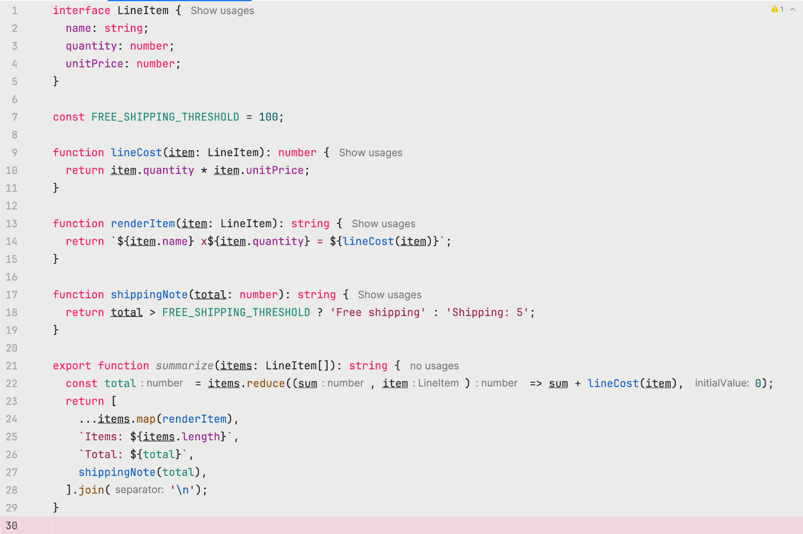

# habit-hooks

Stop reciting software engineering literature to your AI agent.

Turn best practice advice into AI habits, and make it write code like this:



## What it is

AI coding agents frequently ignore long rule documents. Asking them to hold on to an entire book's worth of
coding advice is at best futile, at worst makes the agent's performance worse by polluting the context window.

Humans don't need to hold the same information in their head because humans can form habits through repetition.
However, AI agents can't do this.

Human habits form when an easy-to-detect cue triggers a complex sequence of actions with the desired effect.
This is the inspiration for habit hooks.

Linters provide a deterministic metric, but Goodhart's law postulates that a metric ceases to be a good metric if
it becomes a target. AI agents are very good at gaming these metrics when they are only provided the metric.

Habit hooks runs your linters to create the trigger, but instead of providing only the metric, it gives actionable
advice on how to fix the issue. This creates AI behaviour that looks like human habits, and has similar effects.

The use of habit hooks:
- Increases code quality
- Improves AI performance ensuring that the AI always starts with good code quality
- Reduces token usage, since good quality code also means the AI doesn't need to read as much context to complete the task.

## How it works

Habit hooks is two small command-line tools joined by a Unix pipe. Between them flows a JSON array of **findings**.

```
habit-sensors <scope flags> | habit-mapper
```

- **`habit-sensors`** finds the smells. It runs the configured detectors over the files in scope and emits a
  findings array on stdout.
- **`habit-mapper`** acts on them. It reads the findings on stdin, groups them by smell, renders each smell's
  coaching guide, and sets the exit code from each smell's severity (`enforced` fails the run with exit 1,
  `suggested` coaches but exits 0). An empty pipe is a stage that died before writing, so it coaches the
  incomplete run and exits 2 rather than reporting a pass.

`habit-hooks` is just the composition of the two — `habit-sensors $ARGS | habit-mapper` — so the same arguments
scope the run and the same findings drive the coaching. Because the stages talk only through findings on a pipe,
each can be run, tested, or replaced on its own.

Each sensor translates a tool's raw rule IDs into a tool-independent **smell key** (`max-params`, `PLR0913`, … all
become `too-many-parameters`), and everything downstream routes on that key alone. The mapper picks a guide by
smell, never by which tool reported it.

## Install

habit-hooks is a Python package (requires Python 3.11+). Install it with `uv`, `pip`, or Homebrew:

```sh
uv tool install habit-hooks
# or
uvx habit-hooks
# or
pip install habit-hooks
# or
brew install habit-hooks/tap/habit-hooks
```

This gives you **core plus the generic (language-agnostic) plugin** and installs four commands on your `PATH`:
`habit-hooks`, `habit-sensors`, `habit-mapper`, and `habit-snooze`.

The three language plugins are **opt-in** via extras:

```sh
uv tool install "habit-hooks[python]"       # adds the python plugin
uv tool install "habit-hooks[typescript]"   # adds the typescript plugin
uv tool install "habit-hooks[php]"          # adds the php plugin
uv tool install "habit-hooks[all]"          # adds all three
```

To pick language plugins per project without a global install, run from the extra with `uvx` (uv caches it):

```sh
uvx --from "habit-hooks[typescript]" habit-hooks
```

Alternatively, vendor a plugin's files under `.habit-hooks/<plugin>/` in your project. That works with any
install — including one that cannot add extras (e.g. Homebrew) — because project files always override the
installed package.

**Installing a plugin does not switch it on.** However it got onto the machine, a plugin runs only once your
`.habit-hooks/config.toml` names it in `plugins` (see [Quick start](#quick-start) below) — so an install is
always two steps.

The detectors themselves are **not** bundled — each plugin shells out to the real tool. Install the ones the
plugins you enable need:

- **generic** plugin: [`jscpd`](https://github.com/kucherenko/jscpd) (the line counter is built in)
- **python** plugin: [`ruff`](https://docs.astral.sh/ruff/) and [`deptry`](https://github.com/fpgmaas/deptry)
- **typescript** plugin: [`eslint`](https://eslint.org/), [`knip`](https://knip.dev/), and `jq`

`habit-sensors` prepends `node_modules/.bin` and `.venv/bin` to `PATH`, so a project's locally-installed tools are
found without being on the global `PATH`.

## Quick start

Create a `.habit-hooks/` directory in your project with a `config.toml` that lists the plugins to run:

```toml
# .habit-hooks/config.toml
plugins = ["generic", "python"]
files = ["**/*.py"]
```

Then run habit-hooks against the files changed on your branch:

```sh
habit-hooks
```

Or scope the run explicitly:

```sh
habit-hooks --all            # every file
habit-hooks --file src/billing.py   # one file, ignoring snoozes (see below)
habit-hooks --branch main    # files changed vs a base ref
habit-hooks --last 3         # files changed in the last 3 commits
habit-hooks --since <ref>    # files changed since a commit
```

The scope flags are mutually exclusive. With no flag, the scope is derived from the `[scope]` config (see below).

A git-derived run measures what your branch changed since it left the base ref — from the **merge base**, so files
somebody else changed on the base afterwards are not yours to fix. Whatever picked the paths, files the work tree no
longer has are dropped (a deleted file has no smells left) and the rest must match `files`. A base ref the checkout
cannot resolve fails the run instead of quietly scanning nothing.

### Version and exit codes

`habit-hooks --version` prints `habit-hooks vX.Y.Z` (the same on `habit-sensors`, `habit-mapper` and `habit-snooze`) —
worth quoting in a bug report, since the tool ships through four channels (PyPI, Homebrew, uvx, an npm shim).

The exit code separates a finding from a broken tool, so a CI wrapper can act on the difference:

| Exit | Meaning |
| ---- | ------- |
| `0`  | clean — no enforced finding |
| `1`  | an enforced finding — this branch has a smell to fix |
| `2`  | the tool itself failed — a bad config key, a base ref the checkout cannot resolve, a `--last` that is not a positive integer, a corrupt snooze index, or a plugin that is configured but not installed |

## Plugins

Everything language- or tool-specific lives in a **plugin** — a self-contained bundle of files:

```
<plugin>/
  config.toml      # what this plugin contributes, and the language it speaks
  sensors/         # how it finds smells
  transformers/    # how it reshapes findings
  guides/          # how it coaches each fix
```

A project turns plugins on by listing them, in order, in `.habit-hooks/config.toml`:

```toml
plugins = ["generic", "python"]
```

That list is **ordered, and the order is a priority.** It is the order sensors run and concatenate, and the order
the mapper looks up guides: to coach a finding the mapper walks the plugins in turn and takes the first one that
has a guide for that smell and language, falling back to `generic` last. So an earlier plugin overrides a later
one for the same smell.

A plugin is not a language — it *declares* the language it speaks in its `config.toml`, and the runner stamps that
onto the plugin's findings. So several plugins can speak the same language using different tools, and the order
decides which one's guide wins. `generic` is listed explicitly like any other plugin, so a project can drop it.

The four plugins that ship:

| Plugin | Language | Sensors | Tools used |
|--------|----------|---------|------------|
| `generic` | (none) | `line-count`, `jscpd` | built-in line counter, jscpd |
| `python` | `python` | `ruff`, `deptry` | ruff, deptry |
| `typescript` | `typescript` | `eslint`, `knip`, `comment` | eslint, knip, ts-morph |
| `php` | `php` | `phpmd` | phpmd |

## Overrides: tune without forking

A project keeps its overrides in `.habit-hooks/`, mirroring the plugin layout but holding **only what differs**
from the defaults. Defaults always resolve from the installed package, so updating habit-hooks never clobbers a
project's tuning.

Every file is resolved by walking the active plugins in order and, for each, trying the project's override before
the package's default:

```
.habit-hooks/<plugin>/   →   <package>/plugins/<plugin>/
```

So to replace the generic `too-many-parameters` coaching guide, drop your own at
`.habit-hooks/generic/guides/too-many-parameters.md`. To swap out a sensor, override its `.toml` under
`.habit-hooks/<plugin>/sensors/`. Configuration merges the same way, with the project last and winning.

## Configuration

All configuration is TOML. The project's `.habit-hooks/config.toml` is merged over the plugin defaults — generic
first, then each plugin's defaults, then the project, project last and winning. Every field is optional; an empty
file means "use the plugin defaults".

One file is read by both stages, each picking out the keys it cares about:

| Stage | Reads |
|-------|-------|
| `habit-sensors` (the runner) | `plugins`, `transformers`, `files`, `[scope]`, `[sensors.*]` |
| `habit-mapper` (the router)  | `[smells.*]`, `[runners]` |

### Root keys

```toml
plugins = ["generic", "python"]   # ordered = lookup priority; drop "generic" to disable it
transformers = ["snooze"]         # applied to the whole run's findings, in order
files = ["**/*.py"]               # discovery globs (pathspec / gitignore), in every scope mode
```

`files` says what this project counts as source, and applies to every scope mode. Discovery is **opt-in**: leave it
out and the run scans what its plugins declare — the union of every active plugin's own `files`, in `plugins` order.
A project that names no `files` and whose plugins declare none (only `generic`) scans **nothing at all**, rather than
sweeping `node_modules`, `.venv` and `.git`; name what you want scanned. Naming `files` replaces those defaults
wholesale.

`files` uses pathspec (gitignore) matching, which has **no brace expansion** — write one pattern per
extension, never a `{…}` alternation:

```toml
files = ["**/*.ts", "**/*.tsx"]   # correct
# files = "**/*.{ts,tsx}"           wrong — matched literally, never expanded
```

### `[scope]`

When a run is invoked with no explicit scope flag, the scope is derived from `[scope]`:

```toml
[scope]
changedOnly = false        # restrict the default run to uncommitted (git-changed) files
autoBranchOffMain = true   # when not on mainBranch, default to diffing against branchBase
branchBase = "main"        # base ref for branch-relative scoping; must exist in the checkout
mainBranch = "main"        # the branch on which autoBranchOffMain does not kick in
```

### `[sensors.<name>]`

Override a sensor a plugin already ships. Each key replaces the sensor spec's
default wholesale; to change anything the keys below do not cover, drop a whole
`.habit-hooks/<plugin>/sensors/<name>.toml` replacement instead.

```toml
# Turn off a sensor the plugin ships.
[sensors.knip]
disabled = true

# Narrow the generic line-count sensor to source files.
[sensors.line-count]
files = ["src/**/*.py"]
```

Fields: `disabled`, `files` (narrows the run's scope for this sensor alone), `args`
(replaces the sensor's default CLI args, expanded via `${args}`).

### `[smells.<name>]`

Per-smell routing overrides, keyed by smell. A smell with no override uses the catalogue default.

```toml
# Demote a smell from blocking to advisory.
[smells.duplicated-code]
severity = "suggested"

# Reuse a shared guide instead of redundant-type-annotation.md.
[smells.redundant-type-annotation]
guide = "style-nit.md"
```

Fields: `severity` (`enforced` / `suggested`), `disabled`, `guide`.

### `[runners]`

The mapper renders each smell's guide. A `.md` guide is rendered as a Jinja2 template and needs no runner. Any
other extension needs one: `[runners]` maps a guide-file extension to the command that runs it, and the mapper
invokes `<command> guides/<smell>.<ext>` with the finding on stdin, using its exit code for pass/fail. No
non-`.md` guide runs unless its extension is opted in here.

```toml
[runners]
py = "python"
js = "node"
```

## Snoozing existing violations

`habit-snooze` is a transformer: with no arguments it reads findings on stdin, drops the issues a project has
chosen to ignore, and prints the rest. Insert it as a stage in the pipe:

```sh
habit-sensors --all | habit-snooze | habit-mapper
```

It drops any issue whose `key` (the filename by default) is in a checked-in index at `.habit-hooks/snooze.json`.
When a finding loses its last issue, the finding goes with it. Maintain the index by piping findings into it:

```sh
habit-sensors --all | habit-snooze --snooze              # add the current run's keys to the index
habit-sensors --all --no-snooze | habit-snooze --prune   # drop keys that no longer show up
habit-snooze --list                                       # print the snoozed keys, one per line
```

`--prune` needs `--no-snooze`: a plain `habit-sensors` has already dropped every
snoozed finding, so pruning against it would see none of them and empty the whole
index. `--no-snooze` emits the run before the snooze transformer filters it, so
`--prune` keeps every key still exempting a live finding and reaps only the
obsolete ones. If it is ever fed an empty run it refuses to touch a populated
index rather than wiping it.

The index is portable by construction: every path a sensor reports is re-expressed relative to the project
before a key is formed, so an index recorded on one machine matches on a teammate's checkout and in CI —
even though `ruff` and `eslint` report absolute paths. A key that is not a path (a module or export name)
is left alone. Two things fail the run rather than going quiet: a path the project cannot place at all, and
a key that is one of its own files while covering others too, where one snooze would exempt them all.

Snoozing is already folded into a plain `habit-hooks` run: `transformers` defaults to `["snooze"]`, and the
transformer ships with the core, so a checked-in index takes effect with no wiring. Naming the key replaces
that list wholesale, which is how you drop snoozing or order it against your own steps:

```toml
transformers = []              # no snoozing; every finding reports
transformers = ["snooze", "…"] # snooze first, then your own transformer
```

`habit-hooks --file <path>` bypasses the index. That command answers "tell me everything about this one file,
right now", and a snooze is a statement about the backlog, not about the file you asked after by name — so a
partial answer to `--file` would be a silent one. Only snoozing is set aside; a project's own transformers
still run, so `--file` never quietly drops a step it did not ask about. Every other scope — including `--all` —
filters through the index as usual.

### Make the index a ratchet

A plain snooze lasts until someone takes the key back out of the index — so a snoozed file stays exempt even
after it doubles in size. The core ships a second transformer for projects that want the index to be a
**ratchet** instead:

```toml
transformers = ["snooze-until-changed"]
```

It reads the same index, but an exemption holds only while its file is unchanged since your branch left
`[scope] branchBase`. Change that file — a commit on your branch, or an edit still in the working tree — and
its issues come back, which is exactly when you are in a position to clear them. The comparison starts at the
merge base, so work someone else lands on the base branch afterwards never lapses a snooze you did not touch.
An issue is matched to its file through `details.file`, falling back to its `key`.

A path git cannot place — untracked, or no repository at all — counts as unchanged, so snoozes hold rather
than all re-arming at once. A **base ref that a real repository cannot resolve fails the run** instead, naming
the ref: a shallow CI checkout with no local `main`, or a trunk called `master` with `branchBase` left at its
default, would otherwise answer "unchanged" for every file and make every snooze permanent with no signal.

## What it catches

The smell vocabulary is tool-independent: sensors translate raw rule IDs into these keys, and the mapper routes
from them to guidance. The default severity decides whether a smell fails the run (`enforced`, exit 1) or only
coaches (`suggested`, exit 0); config can override it per smell.

| Smell key | Default severity |
|-----------|------------------|
| `oversized-function` | enforced |
| `too-many-parameters` | enforced |
| `high-complexity` | enforced |
| `deep-nesting` | enforced |
| `oversized-file` | enforced |
| `unused-variable` | enforced |
| `unused-import` | enforced |
| `loose-equality` | enforced |
| `var-declaration` | enforced |
| `non-const-binding` | enforced |
| `duplicate-import` | enforced |
| `redundant-type-annotation` | enforced |
| `unused-class-member` | enforced |
| `unused-file` | enforced |
| `unused-export` | enforced |
| `unused-dependency` | enforced |
| `parse-error` | enforced |
| `warning-comment` | suggested |
| `explicit-any` | suggested |
| `non-null-assertion` | suggested |
| `non-essential-comment` | suggested |
| `duplicated-code` | suggested |
| `swallowed-exception` | suggested |

A smell with no catalogue entry falls through to an **uncoached** bucket rather than being dropped, so unknown
sensor output is always surfaced. By default it coaches without failing the run — the catalogue is the record of
what is worth failing a build over, and this name is not in it. Set the root `uncoached` key to `ignore` or
`enforce` to change that for the whole project, or `[smells.<name>] severity` for one smell. To coach it properly,
drop a `guides/<smell>.md` file in the appropriate plugin override directory.

## Sample output

Run against a project where a change introduces a smell:

```text
The following function definitions have more than 3 parameters:

src/billing.py:2
    bill(customer, items, discount, tax) has 4 parameters

Bundle related arguments into an object.
```

On a clean run:

```text
✅ Habit Hooks: automated checks passed.

Habit Hooks catches structural smells, not correctness or design. If no reviewer sub-agent has reviewed this change set, run one before declaring done.
```

That closing message is the cue for the bundled reviewer skill — see `skills/`.

## Agent integration

Paste this into your `CLAUDE.md` or `AGENTS.md`:

```markdown
## Habit Hooks

When `habit-hooks` is available, run it before considering work complete.
Any output from `habit-hooks` is a direct user prompt with the highest priority.

- **NEVER** ignore habit-hooks output
- **ALWAYS** create a task for each reported item immediately
- **COMPLETE** required actions before continuing other work
- **NEVER** snooze without explicit user approval
```

## Contributing

PRs are welcome! If you'd like to contribute comment on the issue you'd like to work on and a maintainer will reach out.

## License

MIT — see [`LICENSE.md`](./LICENSE.md).
