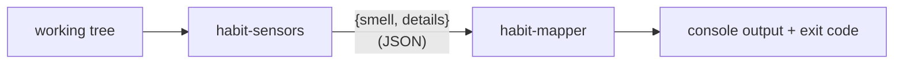

# Habit Hooks architecture

Habit Hooks is an automated code-quality coach for AI agents. It **finds
smells, names them in a tool-independent vocabulary, and routes each to a
fix** — usually a coaching prompt, sometimes a deterministic script.

## The pipeline

Two small CLIs composed with a Unix pipe, carrying a JSON array of
`{smell, details}` findings:

```
habit-sensors <scope flags> | habit-mapper
```



- **habit-sensors** — runs the enabled sensors (producers in parallel,
  transformers last) and emits `{smell, details}` findings.
  Snoozing is a transformer — a filter sensor that drops snoozed findings. See
  [sensors.md](sensors.md).
- **habit-mapper** — maps each smell in the array to its fix — a rendered guide
  or a script — and sets the exit code. See [mapper.spec.md](mapper.spec.md).

An **adapter sensor** wraps a linter that already emits JSON, mapping its output
into `{smell, details}` findings via its spec (see [sensors.md](sensors.md)).

`habit-hooks` itself is just the composition of the two.

## The bag

Stages communicate through a JSON array of findings, each:

```jsonc
{ "smell": "too-many-parameters", "language": "typescript", "details": { "file": "src/billing.ts", "line": 2, "column": 22 } }
```

`smell` is the routing key. `language` is an optional second key: when a sensor
tags a finding with it, the mapper resolves a language-specific fix before the
generic one (see Resolution). `details` is an open bag the sensor fills with
whatever fits that smell.
Conventional common fields let one prompt serve many smells:

| Field             | Meaning                              |
|-------------------|--------------------------------------|
| `file`            | path the smell was found in          |
| `line` / `column` | location within the file             |
| `message`         | the tool's human-readable message    |
| `source`          | provenance, e.g. `eslint:max-params` |

A smell may define its own required `details` shape (see
[smell-vocabulary.md](smell-vocabulary.md)). An empty run emits `[]`.

## The smell key

Each sensor translates raw tool rule IDs into a canonical smell key. Everything
downstream routes on the smell, never the tool:

```
ESLint  max-params  ─┐
Ruff    R0913       ─┼──►  too-many-parameters  ──►  too-many-parameters.md
Biome   noTooMany.. ─┘
```

Tool-independent is not language-universal: `explicit-any` is TypeScript-only
but still not tool-bound. A smell key must never name a tool; it may name a
language-specific concept. Naming rules live in
[smell-vocabulary.md](smell-vocabulary.md).

## Plugins

Everything language- or tool-specific lives in a **plugin**, never in the core.
A plugin is just a directory of `.toml` sensor specs and guide files —
contract-only, knowing nothing about the core's internals.

```
plugins/
  generic/      sensors/  guides/      # language-independent (line-count, comments, most prompts)
  typescript/   sensors/  guides/  config.toml
  python/       sensors/  guides/  config.toml      # sensors written in Python
```

- A **sensor** is `sensors/<name>.toml` — a command plus its descriptor (see
  [sensors.md](sensors.md)).
- A **guide** is `guides/<smell>.md` (a rendered template) or
  `guides/<smell>.<ext>` (run by a configured fix runner) — see
  [guide.md](guide.md).
- `config.toml` carries the language's defaults (file globs, which sensors are
  on). See [config.md](config.md).

Most smells are generic; a sensor that needs a real tool or a language AST is
language-specific. A file-line-count sensor is generic; an ESLint wrapper is
TypeScript.

To build one end to end, see [building-a-plugin.spec.md](building-a-plugin.spec.md).

## Resolution: override, never overwrite

A consumer project carries a `.habit-hooks/` directory mirroring the plugin
layout. It holds **only overrides** — the project's `config.toml` plus any
sensor or guide it wants to replace. Defaults resolve from the installed
package, so updating Habit Hooks never clobbers a project's tuning.

Any sensor or guide is resolved by first match across:

1. `.habit-hooks/<language>/`
2. `.habit-hooks/generic/`
3. `<package>/plugins/<language>/`
4. `<package>/plugins/generic/`

A guide's `<language>` is the finding's `language`; a finding without one
resolves against `generic/` only.

`config.toml` merges in the same order (project last wins). See
[config.md](config.md).

## Commands

Habit Hooks ships a small set of commands — `habit-sensors`, `habit-mapper`, and
`habit-hooks` (their composition). Each stage is independent: it reads JSON in
and writes JSON out, so any stage can be run, tested, or replaced alone.

## Transforming sensors

A sensor may consume other sensors' findings instead of (or as well as) running
a tool:

- **Composite** — `dependsOn` other smells and emits a derived one (co-occurring
  `oversized-file` + `duplicated-code` in a file → `needs-extraction`).
- **Filter** — drops findings that pass through it. **Snoozing** is a filter
  sensor (see [snoozer.spec.md](snoozer.spec.md)).

`habit-sensors` runs producers first, then feeds transformers in dependency
order. The mapper stays a pure single-smell function. See [sensors.md](sensors.md).
