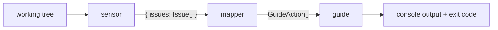

# Habit Hooks architecture

Habit Hooks is a pre-commit / agent quality gate. It does **not** auto-edit
code — its "fix" stage is *coaching*: it hands the agent (or human) the
guidance needed to make the fix itself.

The system is three independently-configurable stages connected by a JSON
**bag**:



- **sensor** — *find the smells.* Run tools (or AST scans) and translate
  each finding into a canonical, tool-independent **smell key**.
- **mapper** — *route the smell.* A pure function `smell → GuideAction`.
  Data, not code.
- **guide** — *coach the fix, gate the commit.* Emit the prompt (default)
  or run a command (override); compute the exit code.

## Why three stages

Detection is **language-specific**; coaching is **general**. The same
"too many parameters" advice applies whether the smell was found by ESLint
in TypeScript or by Ruff in Python. Splitting the pipeline lets us reuse one
prompt set across every language by swapping only the sensor layer.

## The bag

Stages communicate through a single JSON value. The sensor stage produces:

```jsonc
{
  "issues": [
    {
      "smell": "too-many-parameters",   // canonical routing key (kebab-case)
      "file": "src/billing.ts",
      "line": 2,
      "column": 22,
      "message": "Function 'chargeCard' has 5 parameters (max 3).",
      "source": "eslint:max-params",     // provenance only — never routed on
      "details": { "count": 5, "max": 3 } // open bag: metrics + interpolation
    }
  ]
}
```

`smell` is the **only** field the mapper routes on. `source` records which
tool/raw-rule produced it, for debugging and reporting — nothing keys off it.
`details` is free-form; sensors add whatever a prompt or command might want.

An empty run is `{ "issues": [] }`.

## The smell key: the central decoupling

Previously a finding's key *was* its tool (`eslint:max-lines`,
`knip:classMembers`). That coupled our routing — and our prompts — to
specific tools. Now each sensor owns the translation from its tool's raw
rule IDs to a canonical smell key:

```
ESLint  max-params  ─┐
Ruff    R0913       ─┼──►  too-many-parameters  ──►  too-many-parameters.md
Biome   noTooMany.. ─┘
```

**Tool-independent is not the same as language-universal.** `explicit-any`
is meaningful only in TypeScript, but it is still not *tool*-bound — ESLint,
`tsc`, or Biome could each detect it. A smell key must never name a tool; it
may name a language-specific concept.

See [smell-vocabulary.md](smell-vocabulary.md) for the catalogue.

## Stage specs

- [sensors.md](sensors.md) — sensor contract + config (built-in, external
  command, and the future composite sensor)
- [mapper.md](mapper.md) — `smell → GuideAction` config format
- [guide.md](guide.md) — prompt (default) and command (override) actions

## Packaging

One npm package today, with the three stages kept behind clean internal
seams so they can be split into separately-installable packages later if
demand appears. *(Decision 1, human-requested.)*

## Backwards compatibility

The rekey from `tool:rule` keys to smell keys is a **hard break** with a
major version bump. There are no production consumers to migrate yet.
*(Decision 2, human-requested.)*

## Long-term: combinations via composite sensors

Routing on *sets* of co-occurring smells (e.g. "this file has both
`oversized-file` and `duplicated-code` → suggest extracting a module") is
**out of scope for now**. When we want it, it belongs in the sensor layer,
not the mapper: a **composite sensor** subscribes to other sensors' issues
and emits a new derived smell key. The mapper stays a pure single-smell
function and never learns about combinations. *(Decision 3/4,
human-requested — deferred.)*
