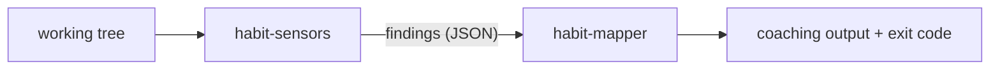

# Habit Hooks architecture

Habit Hooks is an automated code-quality coach for AI agents. It **finds smells,
names them in a tool-independent vocabulary, and routes each to a fix** — usually
a coaching prompt, occasionally a script that does the fix for you.

This document is the map. It explains the pieces and the ideas they share; each
piece and interface then has its own focused document, linked from the bottom.
Read this first — the other documents assume you have.

## The pipeline

Habit Hooks is two small command-line tools joined by a Unix pipe. Between them
flows a JSON array of **findings** — the one data structure the whole system is
built around.

```
habit-sensors <scope flags> | habit-mapper
```



- **`habit-sensors`** finds the smells. It runs the configured detectors over the
  files in scope and emits a findings array. See
  [habit-sensors.spec.md](habit-sensors.spec.md).
- **`habit-mapper`** acts on them. It groups the findings by smell, renders each
  smell's guide, and sets the exit code from each smell's severity. See
  [habit-mapper.spec.md](habit-mapper.spec.md).

`habit-hooks` is simply the composition of the two —
`habit-sensors $ARGS | habit-mapper` — so the same arguments scope the run and
the same findings drive the coaching ([habit-hooks.spec.md](habit-hooks.spec.md)).
Because the stages talk only through findings on a pipe, each one can be run,
tested, or replaced on its own.

## How `habit-sensors` is built: sensors and transformers

`habit-sensors` is an **ETL pipeline** — extract, then transform — assembled from
two kinds of part. The distinction is small but it is the idea the whole runner
rests on.

A **sensor** *senses*. It takes no findings as input; it runs a tool or a script
over the files in scope and produces findings. A linter wrapper, a line counter,
a `grep` for `TODO`s — each is a sensor. Sensors are independent: every sensor
contributes its findings, and the runner concatenates them.

A **transformer** *transforms*. It receives the whole findings array on stdin and
returns a new one. A transformer may add findings, drop them, or rewrite them —
but it lives under one rule:

> A transformer must **pass through every finding it does not handle**.

That single rule is what keeps the system simple. Because a transformer is just a
`findings → findings` function that leaves everything it doesn't recognise
untouched, transformers compose freely and order is the only thing that matters
between them. There is no dependency graph to declare, no "augment vs replace"
mode to choose, and no special final stage — a transformer that wants to replace
some findings simply emits the replacements and drops the originals, and one that
wants to add simply appends.

The runner evaluates a group of parts by **concatenating its sensors, then piping
the result through its transformers in order**:

```
output = transformers ∘ concat(sensors)
```

And this composes recursively: a group can itself stand in for a sensor in a
larger group. That is exactly how plugins nest inside the whole run —

```
whole run = transformers([snooze]) ∘ concat( generic, python )
python    = transformers([])       ∘ concat( ruff, deptry, line-count )
```

— so `habit-sensors` itself is just the outermost group. Snoozing is a
transformer: it reads every finding and drops the ones a project has chosen to
ignore, passing the rest through. It sits at the outermost level because that is
where it sees the whole run's findings. See
[habit-snooze.spec.md](habit-snooze.spec.md).

## The finding

Every stage speaks in **findings**. A finding names one smell and lists where it
occurs:

```jsonc
{
  "smell": "too-many-parameters",   // the routing key — which fix this needs
  "language": "python",             // optional second key — prefers a language's fix
  "details": { "maxAllowed": 3 },   // facts about the smell itself
  "issues": [                       // one entry per occurrence
    { "key": "src/billing.py",
      "details": { "file": "src/billing.py", "line": 2, "signature": "bill(...)" } }
  ]
}
```

`smell` is how everything downstream routes — the mapper picks a guide by smell,
never by which tool reported it. `details` carries facts about the smell, while
`issues` carries one entry per place it was found, each with its own `key` (what
snoozing acts on) and its own `details`. The full field-by-field contract — the
output every sensor must produce and every transformer must preserve — lives in
[sensor-interface.spec.md](sensor-interface.spec.md).

## The smell key

Each sensor translates a tool's raw rule IDs into a canonical **smell key**, and
everything downstream routes on that key alone:

```
ESLint  max-params  ─┐
Ruff    PLR0913     ─┼──►  too-many-parameters  ──►  too-many-parameters.md
Biome   noTooMany.. ─┘
```

A smell key is tool-independent but not necessarily language-universal:
`explicit-any` is TypeScript-only, yet it still names the *smell*, never the tool
or its rule ID. The naming rules and the canonical catalogue live in
[smell-vocabulary.md](smell-vocabulary.md).

## Plugins

Everything language- or tool-specific lives in a **plugin**, never in the core.
A plugin is a **separately-installable package** — its own distribution
(`habit-hooks-<name>`) that a consumer `pip install`s. It does not need to live
in this repo; keeping the first-party plugins here is only a development
convenience (a `uv` workspace that installs them editable). The package is a
self-contained bundle of files, shipped as package data under its import package
`habit_hooks_<name>`:

```
habit_hooks_<name>/
  config.toml      # what this plugin contributes, and the language it speaks
  sensors/         # how it finds smells
  transformers/    # how it reshapes findings
  guides/          # how it coaches each fix
```

The core never walks a `plugins/` directory. It **discovers installed plugins at
run time through a packaging entry point**: each plugin registers itself under
the `habit_hooks.plugins` group, mapping its plugin name to its import package,
and the core reads that group with `importlib.metadata` and locates the package's
bundled files with `importlib.resources`.

```toml
# in the plugin's pyproject.toml
[project.entry-points."habit_hooks.plugins"]
python = "habit_hooks_python"
```

A project turns installed plugins on by listing them, in order, in its config:

```toml
plugins = ["generic", "python"]
```

The `plugins` list **selects and orders** plugins among those installed; a name
that is listed but neither installed nor overridden under `.habit-hooks/` fails
with a clear error naming its install command. Authoring a plugin package end to
end is in [authoring-plugins.spec.md](authoring-plugins.spec.md).

Two things about that list matter.

**It is ordered, and the order is a priority.** It is the order the sensors run
and concatenate, and — for the mapper — the order guides are looked up: to coach a
finding the mapper walks the plugins in turn and takes the first one that has a
guide for that smell and language, falling back to `generic` last. So an earlier
plugin overrides a later one for the same smell.

**A plugin is not a language.** A plugin *declares* the language it speaks in its
`config.toml`, and the runner stamps that onto the plugin's findings (`generic`
declares none). Because the language is declared rather than implied by the
plugin's name, several plugins can speak the same language — an `eslint` plugin
and a `biome` plugin can both declare `typescript`, using different tools, and the
`plugins` order decides which one's guide wins. `generic` is listed explicitly
like any other plugin, so a project can drop it.

Most smells are generic — a line-count or a duplicated-code detector needs no
language knowledge. A sensor only becomes language-specific when it needs a real
tool or a language's AST. To build a plugin end to end, see
[authoring-plugins.spec.md](authoring-plugins.spec.md).

## Resolution: override, never overwrite

A consumer project keeps a `.habit-hooks/` directory that mirrors the plugin
layout but holds **only overrides** — its own `config.toml` plus any sensor,
transformer, or guide it wants to replace. Defaults always resolve from the
**installed plugin package's data**, so updating a plugin never clobbers a
project's tuning.

Any file is resolved by walking the active plugins in order and, for each, trying
the project's override before the installed package's default:

```
.habit-hooks/<plugin>/<file>   →   <installed habit_hooks_<plugin> package data>/<file>
```

The package side of that chain is the entry-point-resolved package directory, not
a path inside this repo — so a project's overrides layer cleanly over a plugin
that was `pip install`ed from anywhere. A project may even run a plugin with **no
installed package at all**, supplying its whole bundle under `.habit-hooks/<plugin>/`;
the chain simply has only its override leg.

Configuration merges the same way, project last. This is the single mechanism
behind both "a project tunes a plugin" and "an earlier plugin beats a later one";
the config format that drives it is in [config.md](config.md).

## The documents

| Document | What it covers |
|----------|----------------|
| [sensor-interface.spec.md](sensor-interface.spec.md) | the finding — the data every stage passes |
| [habit-sensors.spec.md](habit-sensors.spec.md) | the runner: assembling and running the ETL |
| [habit-mapper.spec.md](habit-mapper.spec.md) | routing findings to guides and the exit code |
| [habit-snooze.spec.md](habit-snooze.spec.md) | the snooze transformer and its index commands |
| [habit-hooks.spec.md](habit-hooks.spec.md) | the two stages composed |
| [authoring-plugins.spec.md](authoring-plugins.spec.md) | building a plugin: sensor, transformer, guide |
| [config.md](config.md) | the TOML config format |
| [smell-vocabulary.md](smell-vocabulary.md) | the canonical smell catalogue and naming rules |
| [executable_spec.md](executable_spec.md) | how the `*.spec.md` files run as tests |
