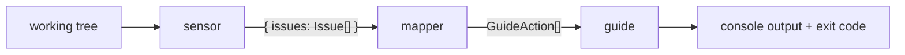

# Habit Hooks architecture

Habit Hooks is an automated code quality coach for AI agents. At its core it
is a **router between smell detectors and fixers**: it finds smells, names
them in a tool-independent vocabulary, and routes each to the right fix
strategy.

The default fix strategy is a *coaching* prompt for the agent but long term 
fix can also be a deterministic script that applies a specific fix. 

The system is three independently-configurable stages connected by a JSON
**bag**:



- **sensor** — *find the smells.* Run tools (or AST scans) and translate
  each finding into a canonical, tool-independent **smell key**.
- **mapper** — *route the smell.* A pure function `smell → GuideAction`.
  Data, not code.
- **guide** — *coach the fix, signal pass/fail.* Apply the smell's fix — a
  markdown template, or a script — and compute the exit code.

## Why three stages

Detection is **language-specific**; coaching is **general**. The same
"too many parameters" advice applies whether the smell was found by ESLint
in TypeScript or by Ruff in Python. Splitting the pipeline lets us reuse one
prompt set across every language by swapping only the sensor layer.

## The bag

Stages communicate through a single JSON value. The sensor stage produces:

```jsonc
{
  "issues": [
    {
      "smell": "too-many-parameters",   // canonical routing key (kebab-case)
      "details": {                      // open bag: metrics + interpolation
        "file": "src/billing.ts",
        "line": 2,
        "column": 22,
      }
    }
  ]
}
```

`smell` is the **only** field the mapper routes on. `details` is the open
bag: each sensor fills it with whatever is relevant to *that* smell.

Common fields are conventional, so most bags look alike and one prompt can
rely on them:

| Field             | Meaning                              |
|-------------------|--------------------------------------|
| `file`            | path the smell was found in          |
| `line` / `column` | location within the file             |
| `message`         | the tool's human-readable message    |
| `source`          | provenance, e.g. `eslint:max-params` |

A smell may define its own required `details` shape (see
[smell-vocabulary.md](smell-vocabulary.md)); its prompt template consumes
exactly that shape.

An empty run is `{ "issues": [] }`.

## The smell key

Each sensor translates its tool's raw rule IDs into a canonical smell key.
The mapper and prompts key off the smell, never the tool:

```
ESLint  max-params  ─┐
Ruff    R0913       ─┼──►  too-many-parameters  ──►  too-many-parameters.md
Biome   noTooMany.. ─┘
```

Tool-independent is not language-universal: `explicit-any` is TypeScript-only
but still not tool-bound (ESLint, `tsc`, or Biome could each detect it). A
smell key must never name a tool; it may name a language-specific concept.

## Stage specs

- [sensors.md](sensors.md) — sensor contract + config (built-in, external
  command, and the multi/composite sensor)
- [mapper.md](mapper.md) — `smell → GuideAction` config format
- [guide.md](guide.md) — prompt (default) and command (override) actions

## Packaging

One npm package, three stages behind clean internal seams so they can split
into separate packages later.

## Combinations

Co-occurring smells (e.g. `oversized-file` + `duplicated-code` → extract a
module) are handled in the sensor layer, not the mapper: a **multi sensor**
depends on other smells, receives their issues from the
[sensor runner](sensors.md), and emits a derived smell. The mapper stays a
pure single-smell function. Which combination smells we ship is a content
decision, layered on later.
